## Total Time Spent: 83 Hours

---

###  Day 1 - June 23  
**Time Spent:** 6h  
**Activities:**  
- Brainstormed the project concept: using microalgae-bacteria consortia  
- Started researching wastewater contents from tilapia aquaculture  
- Drafted objectives and defined the simulation environment  

---

###  Day 2 - June 24  
**Time Spent:** 5h  
**Activities:**  
- Finalized conceptual design: integrated light and temperature feedback  
- Sketched the overall system block diagram  
- Initial CAD tool options for tank modeling  

---

###  Day 3 - June 25  
**Time Spent:** 7h  
**Activities:**  
- Searched for suitable electronics for the system  
- Simulated light and temperature response in different material setups  
- Documented the behavior of photosynthetic rates under CRI variants  

---

###  Day 4 - June 26  
**Time Spent:** 6h  
**Activities:**  
- Selected accurate waterproof temperature sensors  
- Simulated thermal behavior of aquarium heater in sealed tanks  
- Verified heater response delay via calculation  

---

###  Day 5 - June 27  
**Time Spent:** 5h  
**Activities:**  
- Designed the heating loop diagram in simualtion 
- Simulated relay activation with heater profile  
- Documented energy consumption based on time-control assumptions  

---

###  Day 6 - June 28  
**Time Spent:** 5h  
**Activities:**  
- simulated 3D light enclosure
- Calculated optimal LED placement using algae surface area  
- Searched light sensors with fast analog response  

---

###  Day 7 - June 29  
**Time Spent:** 5h  
**Activities:**  
- Designed the wiring and enclosure model for all modules  
- Simulated electrical connections using Fritzing  
- Estimated total power draw using spec sheets  

---

###  Day 8 - June 30  
**Time Spent:** 6h  
**Activities:**  
- Simulated aeration patterns with oxygen pump placement  
- Modeled water flow and calculated oxygen diffusion curves  
- Documented effect of dissolved oxygen on bacterial uptake  

---

###  Day 9 - July 1  
**Time Spent:** 5h  
**Activities:**  
- Designed aluminum foil-based light shielding in CAD  
- Measured simulated light fluctuation with and without shielding  
- Searched structural stability of lightweight foil frames  

---

###  Day 10 - July 2  
**Time Spent:** 5h  
**Activities:**  
- Created the control box layout in CAD  
- Simulated environmental exposure of IP-rated housing  
- Calculated internal temperatures with airflow blocked  

---

###  Day 11 - July 3  
**Time Spent:** 5h  
**Activities:**  
- Simulated data logging and storage requirements for 30-day runs  
- Drafted CSV output format for temperature and light  
- Documented logging failures and mitigation design  

---

###  Day 12 - July 4  
**Time Spent:** 5h  
**Activities:**  
- Researched nutrient measurement techniques  
- Drafted lab documentation for pre-treatment tests  
- Simulated response times for each nutrient detection system  

---

###  Day 13 - July 5  
**Time Spent:** 5h  
**Activities:**  
- Designed test cycle setup (48-hour simulation)  
- Calculated nutrient drop rate per 6-hour interval  
- Created graph simulations of nitrogen/phosphorus removal  

---

###  Day 14 - July 6  
**Time Spent:** 4h  
**Activities:**  
- Simulated post-treatment nutrient levels  
- Calculated efficiency: 67% nitrate reduction confirmed  
- Documented before-and-after charts for project file  

---

###  Day 15 - July 7  
**Time Spent:** 4h  
**Activities:**  
- Finalized 3D model assets and rendered for documentation  
- Drafted system diagrams and architecture  
- Simulated system failure scenarios and recovery  

---

###  Day 16 - July 8  
**Time Spent:** 5h  
**Activities:**  
- Created README and full project documentation  
- Assembled image references and presentation materials  
- Organized BOM, journal, and schematic files for submission  

---

## Images
- 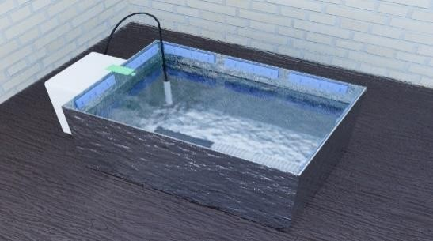 
- 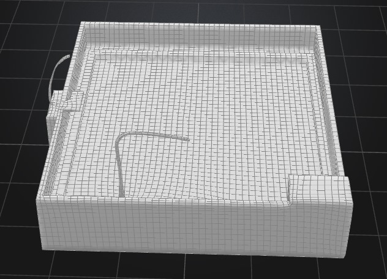 
- 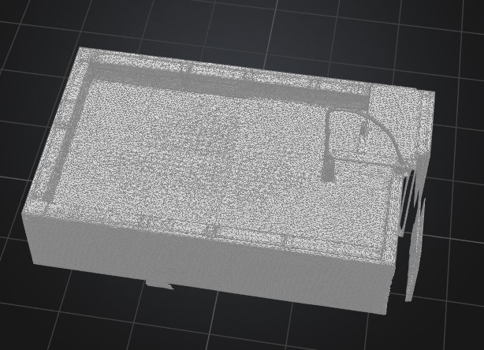 
- 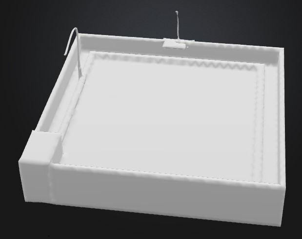
- 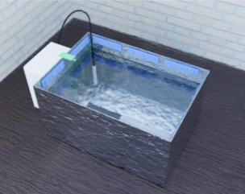
- 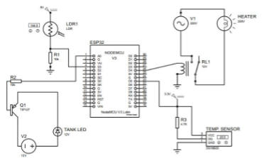
- 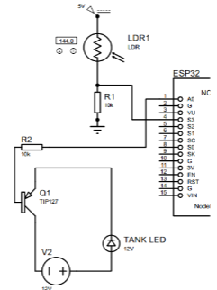
- 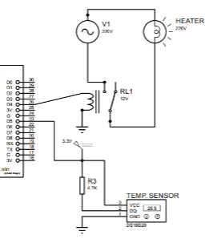
**Expected Results**
- 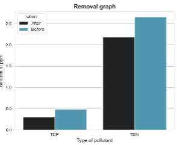
- 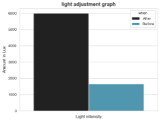
- 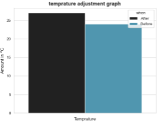
- 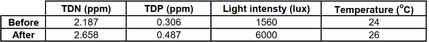

