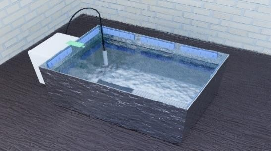
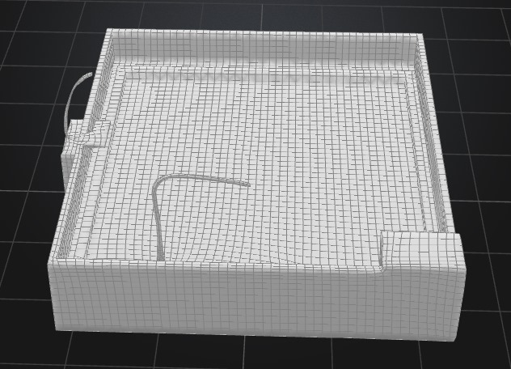
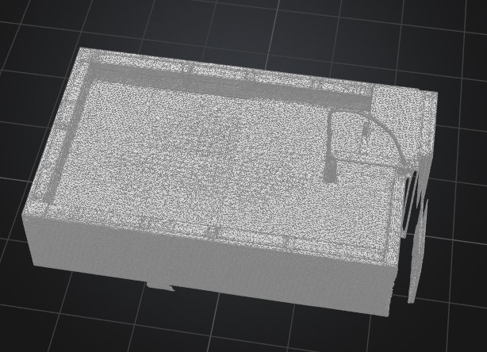
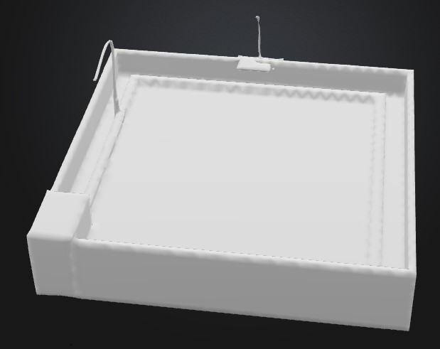

# FC-ABSS (Feedback-Controlled Algae-Bacteria Symbiotic System)

## Description
FC-ABSS is a compact tank-based system that purifies tilapia aquaculture wastewater by using a synergistic mix of microalgae and bacteria. It leverages feedback control systems to maintain optimal growth conditions.

## Why I Built It
Aquaculture systems often produce nutrient-rich wastewater that, if untreated, leads to environmental degradation. I wanted to build a sustainable, automated solution to biologically treat this wastewater while learning real-world applications of embedded systems, feedback loops, and ecological engineering.

## System Overview
- Microalgae-bacteria consortia remove nitrogen and phosphorus from the wastewater.
- Light feedback loop: An LDR monitors intensity; ESP32 adjusts a high-CRI LED strip accordingly.
- Temperature feedback loop: A DS18B20 sensor monitors water temperature; the ESP32 switches a heater via a relay module.
- An oxygen pump ensures aerobic conditions for both bacteria and algae.

## Images
-  
-  
-  
- 
## Bill of Materials (BOM)

| Component                         | Quantity | Estimated Cost | Link                                                                                  |
|----------------------------------|----------|----------------|---------------------------------------------------------------------------------------|
| Raspberry Pi 5 (4GB)             | 1        | $109.27        | [RAM-E-Shop](https://www.ram-e-shop.com/ar/shop/rpi5-board-4gb-raspberry-pi-5-4gb-8882) |
| Aluminum Case for Pi             | 1        | $7.59          | [RAM-E-Shop](https://www.ram-e-shop.com/ar/shop/rpi5-box-aluminum-enclosure-for-raspberry-pi-5-stripe-metal-aluminum-case-9202) |
| Channel 5V Relay Module          | 1        | $10.00         | Amazon, Reddit, etc.                                                                  |
| 12V LED Strip (High-CRI)         | 1        | $25.00         |                                       |
| DS18B20 Temp Sensor (Premium)    | 1        | ~$15.00        | Multiple sources                                                                      |
| LDR Light Sensor Module          | 1        | ~$4.50         | [example](reddit.com+13amazon.eg+13noon.com+13) sources                                                                      |
| Aquarium Heater                  | 1        | $35.00         | -                                                                                     |
| Oxygen Pump (Aquaculture-grade) | 1        | $20.00         | -                                                                                     |
| Aluminum Foil Shielding + Frame | 1        | $5.00          | -                                                                                     |
| 12V, 5A Power Adapter            | 3        | $20.00         | -                                                                                     |
| Jumper Wires + Connectors Kit   | 1        | $8.00          | -                                                                                     |
| Plastic IP-rated Control Box    | 2        | $15.00         | -                                                                                     |

**Total: $274.36**

---
